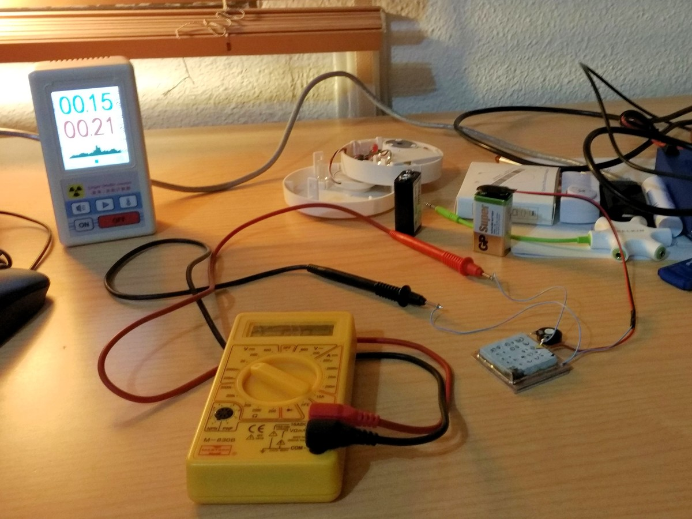

# open-radiation-detector
Portable radiation detector based on an open ionization chamber

Progress
--
- 8/Feb/2017: The Darlington transistors that I was using (MMBT6427, MMBTA14, MMBTA28, MMBTA63, MMBTA64) may not be suitable for the low currents involved in this detection problem (nA or even pA). Yet again I have resorted to Charles Wenzel's awesome website. I may have finally found a proper surface-mount alternative to the MPSAW45A power darlington transistor: the FMMT634 and FMMT734. So I've ordered a bunch of these transistors in order to test the designs again.

- Week of 7/Feb/2017: The new approach is to use an actual chamber that uses a copper electrode insulated from ground by an outer guard ring. The chamber itself is made of [a standard size, commercially available PCB shielding can](http://www.mouser.es/Search/ProductDetail.aspx?R=BMI-S-104virtualkey64820000virtualkey739-BMI-S-104) (in the pictures you can see my attempt at creating one with tin sheet from a metal can). The first prototype actually seemed to have some reaction during the tests. However the second prototype did not. [G-code to mill the electrode](http://jscut.org/jscut.html?gist=c962737e35c9f9b0445b82d079ceb10d).

- On a second thought, the "finger electrodes" may not be a good idea. Since there is a large contact area between each finger, there surely is a lot of leakage current that will mask-out any ion-induced current (one of the biggest concerns explained by [Charles Wenzel's ion chamber website](http://www.techlib.com/science/ion.html))

- 19/Jan/2017 Finally got a .9uCi AM241 source to test, it will be the benchmark for the detector. Unfortunately, the first attempts with the amplifier circuit yield very noisy measurements, that mainly depend on wind and humidity. Surprisingly, it is also very dependent on static electricity. I've also tested again the spark particle detector, but there seems to be absolutely no relation between the sparks and the proximity of the radiation source. ¿Maybe the finger electrodes are too "pointy" because of the manufacture method (milling)? [pic1](pictures/fingerElectrodeZoom1_19Jan2017.jpg) [pic2](pictures/fingerElectrodeZoom2_19Jan2017.jpg)

- Week of 9/Jan/2017: Simulation of circuit amplifiers ["click type"](http://lushprojects.com/circuitjs/circuitjs.html?cct=$+1+0.000015625+31.41906602856942+68+5+50%0Ag+928+416+928+464+0%0A177+928+224+912+352+0+0.7312725129613747+0.7310030522124785+0.000049999999999999996+0.002+12%0Ac+800+320+800+384+0+0.000022000000000000003+0.7321707154576954%0Ag+800+384+800+432+0%0Ar+800+320+736+320+0+8200%0Ar+800+320+896+320+0+33000%0A211+928+352+976+304+0+1+8000+1%0Ar+928+416+928+352+0+40%0Aw+800+320+928+224+0%0Ac+880+112+880+160+0+0.000022000000000000003+6.122038321055448%0AR+880+112+832+80+0+0+40+8.4+0+0+0.5%0Ar+944+112+944+160+0+33000%0Aw+880+112+944+112+0%0Aw+880+160+944+160+0%0A162+944+160+928+224+1+2.1+1+0+0+0.01%0Aw+688+288+688+160+0%0Aw+640+160+688+160+0%0Aw+640+192+640+160+0%0Ar+272+304+336+208+0+1000000000%0Ar+640+224+640+304+0+18%0Aw+624+448+688+448+0%0Aw+736+320+688+320+0%0Ar+688+320+688+448+0+220.00000000000003%0Aw+304+336+336+448+0%0Aw+624+448+336+448+0%0Aw+592+208+336+208+0%0A174+272+368+304+304+0+200000000000+0.9851000000000001+Resistance%0Ag+624+448+624+480+0%0At+640+304+688+304+0+1+-0.1533803623127099+0.664742220730739+20000%0At+592+208+640+208+0+-1+-0.263860697764259+-0.4172092930979039+20000%0Aw+688+160+880+112+0%0Ao+7+64+0+2337+0.5846006549323611+0.023384026197294447+0+-1+0%0Ao+14+64+0+2337+1.25+0.0015625+1+-1+0%0Ao+4+1024+0+2337+5+0.0015625+2+-1+0%0Ao+21+64+0+2338+10+0.00078125+3+-1+0%0A), ["LED scale type"](http://lushprojects.com/circuitjs/circuitjs.html?cct=$+1+0.000015625+31.41906602856942+68+5+50%0Ar+784+320+784+464+0+167%0AR+432+96+384+64+0+0+40+12+0+0+0.5%0A162+720+336+720+400+1+2.35+1+0+0+0.02%0Aw+496+176+496+96+0%0Aw+432+96+496+96+0%0Aw+432+128+432+96+0%0Aw+96+272+128+384+0%0Aw+288+384+128+384+0%0Aw+384+144+128+144+0%0A174+64+304+96+240+0+100000000000+0.49010000000000004+Resistance%0Ag+432+384+432+416+0%0At+464+192+496+192+0+1+-6.516184439164558+0.5942797072286803+20000%0At+384+144+432+144+0+-1+6.075435564035981+-0.44074887512857686+20000%0Ar+432+384+288+384+0+1000%0A162+592+208+592+272+1+2.4+0+1+0+0.02%0A162+656+272+656+336+1+2.35+1+1+0+0.02%0Ag+656+464+656+496+0%0Aw+592+464+656+464+0%0Aw+592+208+784+208+0%0Ar+592+464+592+272+0+2700%0Ar+720+464+720+400+0+470%0Ar+656+464+656+336+0+1800%0Aw+592+208+496+208+0%0Aw+656+464+720+464+0%0Aw+720+464+784+464+0%0Aw+592+272+656+272+0%0Aw+656+336+720+336+0%0Aw+432+160+464+192+0%0Az+784+320+784+208+1+0.805904783+5%0A174+432+240+464+304+0+10000000+0.12380000000000002+Resistance%0Aw+432+240+432+160+0%0Aw+432+384+432+304+0%0Aw+432+304+464+272+0%0Aw+64+240+128+144+0%0Ao+22+64+0+2338+20+0.05+0+-1+0%0Ao+0+64+0+2337+5+0.05+1+-1+0%0A)

- How to make a simple low-cost radiation detector? Learn about ionization chambers thanks to [Charles Wenzel's website](http://www.techlib.com/science/ion.html)

- Week of 1/Jan/2017: First learn of spark particle detectors. [Design, build and test a PCB electrode](https://github.com/vlachoudis/bCNC/pull/480) (but without any radiation source to be tested). [video](https://www.youtube.com/watch?v=s3N2EDGwe9U)
